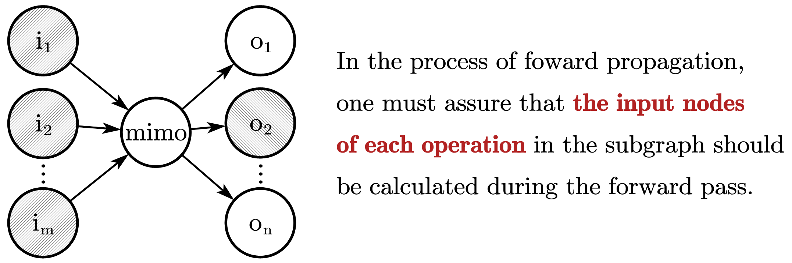
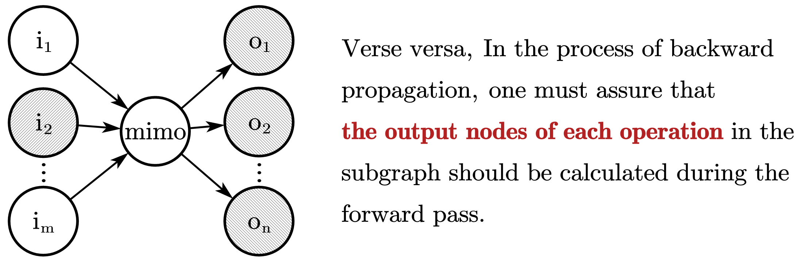

## 子图（subgraph）

**前向传播 `eval(*ys, feed_dict=fd)`**

假设 `ys` 是需要评估的结点，`xs = feed_dict.keys()` 是前向传播的起点，则前向传播子图为 `ys and 祖先(ys)` ∩ `xs and 子孙(xs)`

**反向传播** `diff(ys, xs, feed_dict=fd)`

反向传播子图为 `ys and 祖先(ys)` ∩ `xs and 子孙(xs) `

## 前向传播

## 反向传播

